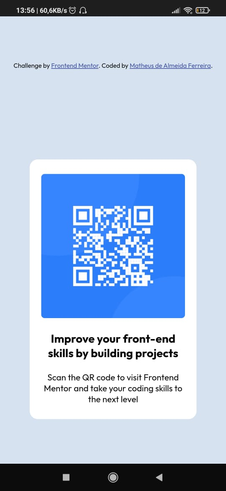
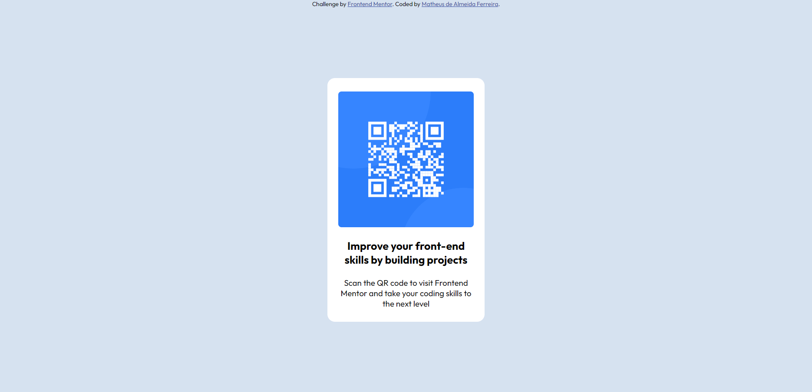

# Frontend Mentor - QR code component solution

This is a solution to the [QR code component challenge on Frontend Mentor](https://www.frontendmentor.io/challenges/qr-code-component-iux_sIO_H). Frontend Mentor challenges help you improve your coding skills by building realistic projects. 

## Table of contents

- [Overview](#overview)
  - [Screenshot](#screenshot)
  - [Links](#links)
- [My process](#my-process)
  - [Built with](#built-with)
  - [What I learned](#what-i-learned)
  - [Continued development](#continued-development)
  - [Useful resources](#useful-resources)
- [Author](#author)

## Overview

### Screenshot




### Links

- Solution URL: (https://github.com/Matheus-A-Ferreira/QR-code-component)
- Live Site URL: (https://your-live-site-url.com)

## My process

### Built with

- HTML5
- CSS custom properties
- Flexbox
- CSS3
- Mobile-first workflow


### What I learned

Learned how to apply the height of the body to the hole screen and how to aply "display: flex;" properly

```css
html{
  height: 100%;
}

body{
  display: flex;
  flex-wrap: wrap;
  align-items: center;
  justify-content: center;
  width: 100vw;      
  min-height: 100%;
}
```

### Continued development

I noticed a need to practice more with CSS and learn how to use it properly

### Useful resources

- [CSS Layout - Horizontal & Vertical Align](https://www.w3schools.com/css/css_align.asp) - This is an amazing article which helped me finally understand many methods I can use to centralize an element. I'd recommend it to anyone still learning this concept.

## Author

- Website - [Matheus de Almeida Ferreira](https://matheus-a-ferreira.github.io/Portfolio/)
- Frontend Mentor - [@Matheus-A-Ferreira](https://www.frontendmentor.io/profile/Matheus-A-Ferreira)
